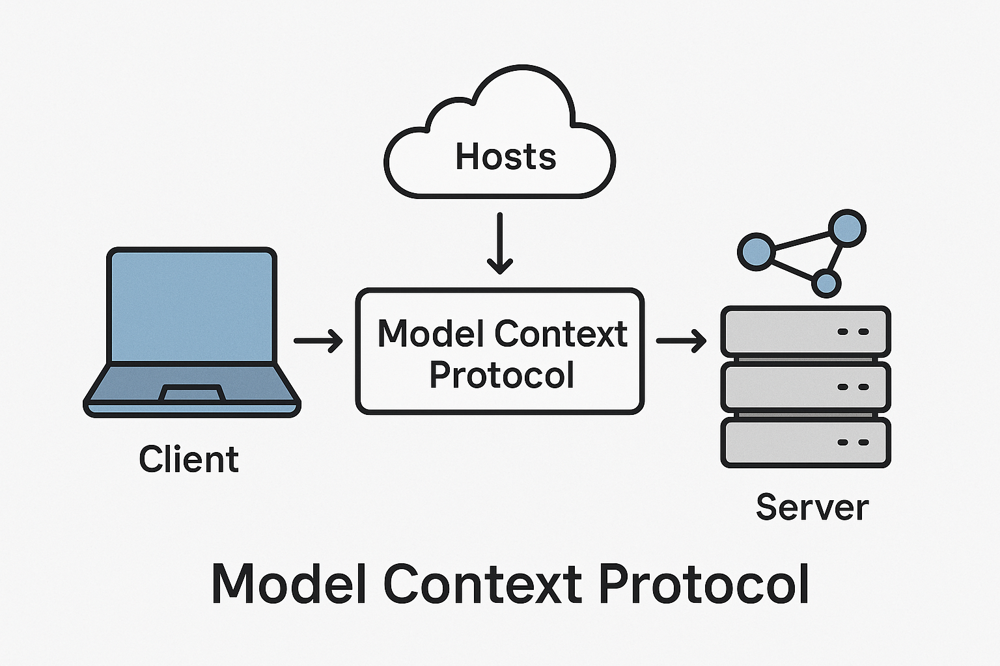

# Model Context Protocol (MCP) For Dummies

<div align="center">
  
  <br><br>
  
  <a href="LICENSE"></a>
  <a href="https://github.com/TMHSDigital"></a>
  <a href="CONTRIBUTING.md"></a>
  <a href="https://commonmark.org"></a>
</div>

> A comprehensive guide to understanding and implementing the Model Context Protocol (MCP)

## What is MCP?

Model Context Protocol (MCP) is an open standard (introduced in late 2024 by Anthropic) that **standardizes how AI models connect to data sources and tools**. This repository aims to provide a clear, comprehensive explanation of MCP, its architecture, implementations, and practical applications.

An MCP *server* is a lightweight program that exposes specific capabilities (data, prompts, or functions) over a JSON-RPC interface, enabling LLM applications to consume them. In the MCP architecture:

- An AI application (the *host*, e.g. Claude, an IDE, or an agent) uses a built-in *client* to open a stateful JSON-RPC connection to each MCP server
- MCP servers act like USB-C ports or "plugins" for AI – they let the model query your company wiki, run database queries, search code repositories, or invoke external APIs in a uniform way

## Repository Contents

```
Model_Context_Protocol_For_Dummies/
├── docs/                          # Documentation
│   ├── architecture.md            # Client-server architecture details
│   ├── features.md                # Resources, Prompts/Workflows, and Tools
│   ├── implementations.md         # Notable MCP server implementations
│   ├── development-guide.md       # Building and deploying MCP servers
│   └── use-cases.md               # Real-world applications and examples
├── examples/                      # Code examples
│   ├── typescript/                # TypeScript examples
│   │   └── simple-server.ts       # Weather data MCP server
│   └── python/                    # Python examples
│       └── simple_server.py       # Note-taking MCP server
├── CODE_OF_CONDUCT.md             # Code of conduct
├── CONTRIBUTING.md                # Contribution guidelines
├── LICENSE                        # MIT License
└── README.md                      # This file
```

## Getting Started

Browse the repository to learn about:

| Topic | Description |
|-------|-------------|
| [Architecture](docs/architecture.md) | Understanding the client-server architecture and protocol details |
| [Features](docs/features.md) | Resources, Prompts/Workflows, and Tools/Functions |
| [Implementations](docs/implementations.md) | Notable MCP server implementations |
| [Development Guide](docs/development-guide.md) | Building and deploying your own MCP servers |
| [Use Cases](docs/use-cases.md) | Real-world applications and examples |
| [Research Report](research-1.md) | Comprehensive technical overview of MCP |

## Quick Example

Here's a brief example of what an MCP server looks like in TypeScript:

```typescript
import { Server } from '@modelcontextprotocol/sdk';

const server = new Server({
  name: 'SimpleServer',
  version: '1.0.0',
  features: { resources: true, tools: true }
});

// Register a simple tool
server.registerToolHandler({
  listTools: async () => ({
    tools: [{
      name: 'greet',
      description: 'Returns a greeting',
      parameters: {
        type: 'object',
        properties: { name: { type: 'string', description: 'Name to greet' } },
        required: ['name']
      }
    }]
  }),
  callTool: async ({ name, parameters }) => {
    if (name === 'greet') {
      return { result: `Hello, ${parameters.name}!` };
    }
    throw new Error(`Unknown tool: ${name}`);
  }
});

server.listen();
```

## Why Use MCP?

- **Standardized Interface**: Consistent way for AI models to access tools and data
- **Model Agnostic**: Works with Claude, GPT, and other LLMs
- **Composable**: Mix and match servers based on your needs
- **Secure**: Built with user consent and data privacy in mind
- **Extensible**: Build custom servers for your specific use cases

## Contributing

We welcome contributions to improve this resource! Please see [CONTRIBUTING.md](CONTRIBUTING.md) for guidelines.

## License

This repository is licensed under [MIT License](LICENSE).

---

<div align="center">
  <sub>Maintained with ❤️ by <a href="https://github.com/TMHSDigital">TM Hospitality Strategies</a></sub>
</div>

