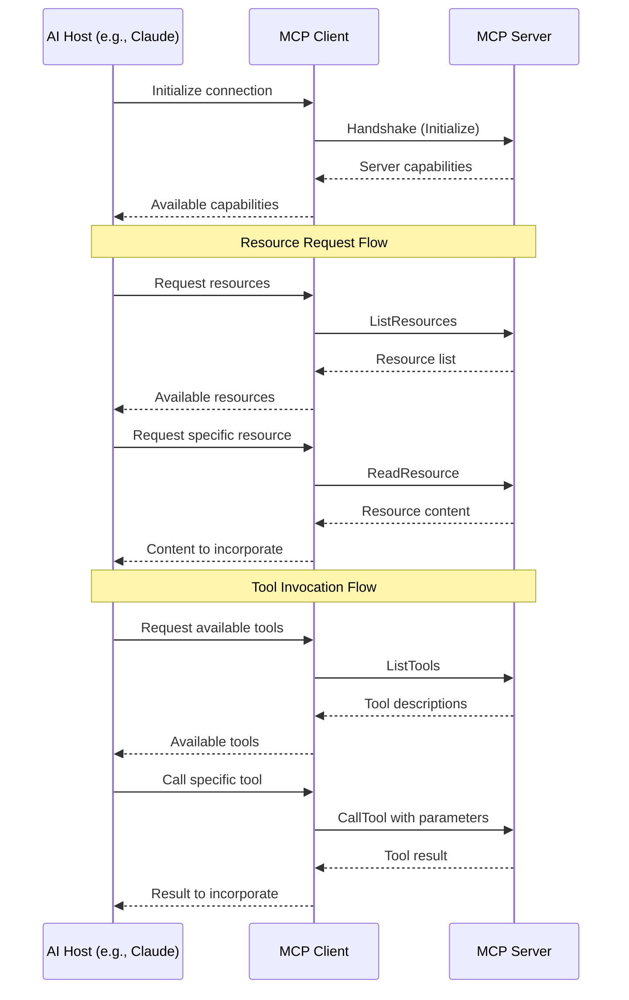

# Getting Started with Model Context Protocol (MCP)

This guide will help you understand MCP through visual examples and code walkthroughs, bridging the gap between theory and implementation.

## Understanding the MCP Flow

MCP uses a client-server architecture with JSON-RPC communication. Here's what the interaction looks like:



## From Concept to Code: Example Walkthrough

Let's see how the theoretical MCP flow maps to actual code, using the Python example from this repository.

### 1. Server Initialization

First, an MCP server defines its capabilities and starts listening:

```python
# From examples/python/simple_server.py
class NoteMCPServer:
    """A simulated MCP server for note-taking functionality."""
    
    def __init__(self):
        self.name = "NoteMCPServer"
        self.version = "1.0.0"
        self.notes = {
            "note-1": {
                "id": "note-1",
                "title": "Welcome to MCP Notes",
                # ...other properties...
            }
        }
```

**How this maps to the protocol:** The server's name, version, and supported features (resources and tools in this case) are part of the handshake process when a client connects.

### 2. Resource Handling

MCP servers can expose data as resources:

```python
# Resource listing endpoint
async def list_resources(self) -> Dict[str, List[Dict[str, str]]]:
    """List available resources (notes)."""
    resources = []
    for note_id, note in self.notes.items():
        resources.append({
            "id": note_id,
            "name": note["title"],
            "description": f"Note created on {note['created_at'].split('T')[0]}"
        })
    return {"resources": resources}

# Resource reading endpoint
async def read_resource(self, resource_id: str) -> Dict[str, str]:
    """Read a specific resource (note)."""
    if resource_id in self.notes:
        return {"content": json.dumps(self.notes[resource_id], indent=2)}
    raise ValueError(f"Note {resource_id} not found")
```

**How this maps to the protocol:** These methods directly correspond to the `ListResources` and `ReadResource` JSON-RPC methods in the MCP specification. When an AI asks to see available resources, the client calls `list_resources()`, and when it wants specific content, the client calls `read_resource()`.

### 3. Tool Handling

MCP servers can expose callable functions as tools:

```python
# Tool listing endpoint
async def list_tools(self) -> Dict[str, List[Dict[str, Any]]]:
    """List available tools."""
    return {
        "tools": [
            {
                "name": "create_note",
                "description": "Create a new note",
                "parameters": {
                    "type": "object",
                    "properties": {
                        "title": {
                            "type": "string",
                            "description": "Title of the note"
                        },
                        # ...other parameters...
                    },
                    "required": ["title", "content"]
                }
            },
            # ...other tools...
        ]
    }

# Tool call endpoint
async def call_tool(self, name: str, parameters: Dict[str, Any]) -> Dict[str, Any]:
    """Call a specific tool."""
    if name == "create_note":
        return await self._create_note(parameters)
    # ...other tool handlers...
    raise ValueError(f"Tool {name} not found")
```

**How this maps to the protocol:** These methods correspond to the `ListTools` and `CallTool` JSON-RPC methods. The AI first requests available tools through `list_tools()`, then invokes specific functionality with `call_tool()`.

## JSON-RPC Messages in Action

Here's how the actual messages look when an AI interacts with our note-taking MCP server:

### ListResources Request/Response

```json
// Client -> Server
{
  "jsonrpc": "2.0",
  "method": "ListResources",
  "params": {},
  "id": 1
}

// Server -> Client
{
  "jsonrpc": "2.0",
  "result": {
    "resources": [
      {
        "id": "note-1",
        "name": "Welcome to MCP Notes",
        "description": "Note created on 2025-05-01"
      },
      {
        "id": "note-2",
        "name": "Shopping List",
        "description": "Note created on 2025-05-02"
      }
    ]
  },
  "id": 1
}
```

### CallTool Request/Response

```json
// Client -> Server
{
  "jsonrpc": "2.0",
  "method": "CallTool",
  "params": {
    "name": "create_note",
    "parameters": {
      "title": "Meeting Notes",
      "content": "Discussed MCP integration plans for Q3",
      "tags": ["meeting", "planning"]
    }
  },
  "id": 2
}

// Server -> Client
{
  "jsonrpc": "2.0",
  "result": {
    "result": {
      "id": "note-3",
      "title": "Meeting Notes",
      "message": "Note created successfully"
    }
  },
  "id": 2
}
```

## Creating Your First MCP Server

Now that you understand the concepts and code, let's build a minimal MCP server:

1. **Choose a language**: The MCP SDK is available in TypeScript/Node, Python, and other languages.

2. **Install dependencies**: For Python, you'll need a JSON-RPC library. For TypeScript, use the official `@modelcontextprotocol/sdk`.

3. **Define your server**: Decide what resources and tools your server will expose.

4. **Implement the handlers**: Create handlers for the MCP methods (ListResources, ReadResource, ListTools, CallTool).

5. **Test your server**: Use an MCP client or the MCP Inspector tool to test your server.

## Common Patterns

### Resource Pattern

Resources typically follow this pattern:
- **ListResources**: Return metadata about available resources
- **ReadResource**: Return the actual content of a specific resource

### Tool Pattern

Tools typically follow this pattern:
- **ListTools**: Describe available tools with their parameters (using JSON Schema)
- **CallTool**: Execute a tool with the provided parameters and return results

## Next Steps

Now that you understand the basics:

1. Explore the [Python example](../examples/python/simple_server.py) or [TypeScript example](../examples/typescript/simple-server.ts) in detail
2. Read the [Architecture document](architecture.md) for deeper technical details
3. Check the [Research Report](../research-1.md) for comprehensive protocol understanding
4. Learn about real-world applications in the [Monday.com Integration study](../research-2.md)

Happy building with MCP! 